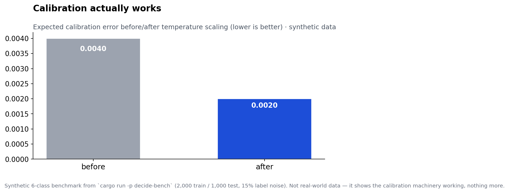

# Gavel

The open typed-decision layer for AI agents.

Gavel answers typed questions with bounded decisions. You define a question with an input schema, an output schema, and a confidence policy. You train it on labeled examples. Then you ask it things and get back a JSON decision, a calibrated confidence number, and one of four actions: `act`, `review`, `escalate`, or `abstain`. It does not generate prose. It runs on your hardware, under MIT license, and you can read every line of the model code.

## The problem

Agents burn LLM calls on work that isn't generative: routing a ticket, picking a tool, scoring a transaction, deciding whether to escalate. Each call costs cents, takes seconds, and returns confidence as a vibe. Gavel pulls that work into a small supervised model per question: microseconds per decision, zero marginal cost, and confidence numbers you can check against reality.

## Quickstart

You need Rust (stable). The server is the fastest way to try it.

```bash
git clone https://github.com/syedsohailhussain1/gavel.git
cd gavel
cargo build -p decide-server --release
./target/release/gavel-server
# gavel-server listening on 0.0.0.0:7575
```

In another terminal, define a question, train it, and ask it:

```bash
curl -s -X POST http://localhost:7575/define -H 'Content-Type: application/json' -d \
  '{"name":"route_ticket","inputSchema":{"type":"object"},"outputSchema":{"type":"object"}, \
    "policy":{"act_above":0.9,"review_low":0.6,"review_high":0.9}}'

curl -s -X POST http://localhost:7575/train -H 'Content-Type: application/json' -d \
  '{"question":"route_ticket","examples":[ \
    {"input":"charged twice on my card","label":"billing"}, \
    {"input":"refund my invoice","label":"billing"}, \
    {"input":"app crashes on upload","label":"technical"}, \
    {"input":"500 error from the api","label":"technical"}]}'

curl -s -X POST http://localhost:7575/ask -H 'Content-Type: application/json' -d \
  '{"question":"route_ticket","input":{"subject":"refund my invoice"}}'
# {"action":"act","confidence":0.983,"output":{"label":"billing"}}
```

Four examples is enough to see it work. It is not enough to trust it. For anything real, train on a few hundred labeled examples per question, hold out a validation set, and calibrate (below).

From another device on the same network, replace `localhost` with the server's LAN IP. The server binds `0.0.0.0:7575` and has no auth, so don't expose it to the internet.

## How it works

Each question gets its own classifier, served by one of three engines:

- **logistic** (default): multinomial logistic regression over hashed bag-of-words features (FNV-1a into 2^14 buckets, lowercase, term-frequency weights), trained with seeded SGD so reruns are bit-identical. Pure Rust, no model downloads.
- **tfidf**: native-Rust TF-IDF (word 1–2 grams, sublinear tf, L2-normalized rows) plus logistic regression, loaded from a model artifact exported from a matching sklearn pipeline. The recipe reproduces sklearn's logits to floating-point noise, so you train in Python and serve in Rust with no ONNX runtime.
- **onnx**: real ONNX Runtime inference behind the same `Engine` trait, for models exported from PyTorch (e.g. fine-tuned transformers).

All three sit behind the same policy layer, so `/ask`, calibration, and abstention work identically whichever you pick. Select per question with `"engine"` on `/define`.

The policy maps confidence to an action:

- confidence >= `act_above` (default 0.9) → `act`
- `review_low` <= confidence < `act_above` (default 0.6–0.9) → `review`
- below that → `escalate`
- `abstain` bypasses confidence entirely — the model declines the input, not the label (below)

Asking a question that was defined but never trained returns an empty output at confidence 0, which the default policy maps to `escalate`. Train before you serve.

### Calibration, plainly

A classifier's raw "probability" is usually overconfident. Gavel fixes that with temperature scaling: one scalar `T` divides the logits before the softmax, fitted on held-out validation examples by minimizing negative log-likelihood. `T > 1` softens overconfident predictions; `T < 1` sharpens underconfident ones.

We measure miscalibration with expected calibration error (ECE): bucket predictions into 10 confidence bins, and in each bin compare average confidence against actual accuracy. Perfect calibration is 0. `GET /metrics` reports ECE before and after calibration, so you can see whether it helped on your data instead of taking our word for it.

### Abstention, plainly

Confidence tells you how sure the model is *among the labels it knows*. It says nothing about inputs the model was never trained on — a sourdough recipe can score 0.9 "support" because the words happen to line up. Gavel handles that with a separate gate: the **energy score**, `E(x) = -logsumexp(logits)` over the raw logits. Higher energy means "less like anything in training."

Set `"abstain_energy_above"` in the policy and any input scoring above it returns `abstain` before confidence is even consulted. Fit the threshold as a percentile of energies on held-out calibration data (p95 is a sane start: it keeps ~95% of in-task inputs). The scale is model-specific — a threshold from one question means nothing for another, so fit per question. Currently the TF-IDF engine reports energy; the logistic engine doesn't yet.

On a synthetic out-of-distribution set, the p95 gate held 95.5% of in-task inputs at 84.3% accuracy while abstaining on 72.6% of the synthetic OOD — but synthetic far-OOD is the easy case, so treat that number as optimistic. Real near-OOD (a vague "thing is broken") is where the gate earns its keep, and where it needs the most testing.

## HTTP API

Base URL `http://<host>:7575`. All responses are JSON. Errors return HTTP 400 with `{"error": "<message>"}` (bad JSON, unknown question, empty training set, unknown route).

| Method | Path | Body | Returns |
|---|---|---|---|
| POST | `/define` | `{"name","inputSchema","outputSchema","policy"?,"engine"?}` | `{"ok":true}` |
| POST | `/train` | `{"question","examples":[{"input","label"}]}` | `{"ok":true}` |
| POST | `/calibrate` | `{"question","validation":[{"input","label"}]}` | `{"ok":true}` |
| POST | `/ask` | `{"question","input"?,"state"?,"questions"?}` | `{"output","confidence","action",...}` or `{"answers":[...]}` |
| GET | `/metrics?question=<name>` | — | `{"trained","classes","temperature","ece_before","ece_after"}` |
| GET | `/questions` | — | `{"questions":[...]}` |

`policy` is optional on `/define`; omit it for the default (act >= 0.9, review 0.6–0.9, escalate below 0.6). The policy may also carry `"abstain_energy_above"` for the abstention gate. `engine` selects the inference engine: `"logistic"` (default), `{"tfidf": {"model": "<path.json>"}}`, or `{"onnx": {...}}`. On `/ask`, `"questions"` carries a multi-question batch (see below); omit it for a single decision. `"state"` is a flat object of string fields prepended to the input as `key: value` lines (keys sorted) — transparent context, not schema-aware featurization. Example inputs can be strings or objects; object inputs contribute their string values. Labels in `/calibrate` must have been seen during training.

### Yes/no (Noul) questions

Some decisions are yes/no, not pick-one-of-N. A Noul item — `{"kind":"noul","id":"...","statement":"...","class":"..."}` — asks "is this statement true?" and answers with `p_true`, the calibrated probability of that class. It's a one-vs-rest projection of the choice distribution, not a separate model: `statement` is descriptive and doesn't drive inference; `class` selects the probability. `prediction` is `"yes"` when `p_true >= 0.5`; `confidence = max(p_true, 1-p_true)`. Since confidence floors at 0.5, a Noul answer is `act`, `review`, or `abstain` — never `escalate`.

### Batching

`POST /ask` accepts `"questions": [...]` — up to hundreds of choice and Noul items answered in one call, returned in order under `"answers"`. Items share the question's engine, policy, and input; each is answered independently against the same input. Validation is all-or-nothing: one bad item fails the whole request with a 400 and an indexed error, so you never guess which answers are missing. See the [cookbook](docs/cookbooks/batch-200-judgments.md) for a measured 200-question run: 54.4 ms total, 0.27 ms per question, on a 2-core VM.

## SDKs

**TypeScript** (`ts/decide`, package `@gavel/decide` — not on npm yet, build from source):

```bash
cd crates/decide-napi && npm install && npm run build && cd ../..
cd ts/decide && npm install && npm run build && npm run example
```

```ts
import { Engine } from "@gavel/decide";

const engine = new Engine();
engine.define({
  name: "route_ticket",
  inputSchema: { type: "object" },
  outputSchema: { type: "object" },
  policy: { actAbove: 0.9, reviewLow: 0.6, reviewHigh: 0.9 },
});
engine.train("route_ticket", [
  { input: "charged twice on my card", label: "billing" },
  { input: "app crashes on upload", label: "technical" },
  // ...more examples
]);
engine.calibrate("route_ticket", validationExamples);

const d = engine.ask("route_ticket", { subject: "refund my invoice" });
// { output: { label: "billing" }, confidence: 0.98, action: "act" }
```

`npm test` runs a small smoke suite (`test/smoke.ts`). The native binding is loaded from `crates/decide-napi`; set `DECIDE_BINDING` to override the path.

**Python** (`py/gavel_client.py`, stdlib only — copy the file, no install):

```bash
./target/release/gavel-server &   # server must be up
python3 py/example.py             # full demo: define, train, calibrate, ask
```

```python
from gavel_client import GavelClient
client = GavelClient("http://localhost:7575")
client.define("route_ticket", {"type": "object"}, {"type": "object"})
client.train("route_ticket", [("charged twice", "billing"), ("app crashes", "technical")])
print(client.ask("route_ticket", {"subject": "refund my invoice"}))
```

## Benchmarks

`cargo run -p decide-bench --release` trains, calibrates, and evaluates the engine on a fixed-seed synthetic dataset (2,000 train / 500 validation / 1,000 test, 6 classes, 15% cross-class word noise). Every run writes a timestamped JSON report to `benches/results/`. These numbers are synthetic — they measure the implementation, not real-world accuracy. Run the same harness on your own labeled data before trusting any decision.

Measured on this machine (your numbers will differ slightly):

| metric | value |
|---|---|
| train wall-time (2,000 examples) | ~31 ms |
| calibrate wall-time (500 examples) | ~104 ms |
| per-ask latency p50 / p99 | 2.5 µs / 3.4 µs |
| single-thread throughput | ~400,000 QPS |
| accuracy (test, synthetic) | 0.9980 |
| ECE before → after calibration | 0.0040 → 0.0020 |
| fitted temperature | 0.639 |

The latency figure is in-process inference only — no network, no queueing. The accuracy figure reflects a synthetic dataset with distinctive per-class vocabulary; real text with paraphrase and ambiguity will score lower.



## Gavel vs hosted decision APIs

| | Gavel | Hosted decision API |
|---|---|---|
| Latency | microseconds, in-process (2.5 µs p50 measured) | network round-trip on top of inference |
| Marginal cost per decision | $0 (your hardware) | per-call metered pricing |
| Data | never leaves your network | sent to a third party |
| Calibration | open method, ECE published per question | proprietary, take their word for it |
| Model | small supervised models (linear, TF-IDF, exported transformers) — simple, inspectable, limited | undisclosed, presumably larger |
| Offline | yes | no |
| Paraphrase / nuance | weak for word-count engines — needs shared vocabulary with training data | typically stronger |

Gavel wins on cost, latency, privacy, and auditability. It loses on language understanding: a linear model over word counts cannot handle negation, paraphrase with unseen words, or multi-intent inputs the way a larger model can. The ONNX engine narrows that gap by running exported transformer models behind the same API — the price is a model file you must train or distill yourself, which is exactly what the training pipeline on the roadmap is for.

### The numbers, in pictures

From the [independent phishing benchmark reproduction](benches/results/phishing-comparison.md) (2,000 emails; Jev/Haiku numbers quoted from the published 2026-09-17 report, not re-run):


Charts are generated by `python3 benches/charts/make_charts.py` — every number is traceable to a measured run or a cited report.

## Cookbooks

`docs/cookbooks/` holds end-to-end patterns measured on real runs:

- [200 judgments, one call](docs/cookbooks/batch-200-judgments.md) — 200 mixed choice/yes-no questions in a single `/ask`, 54.4 ms on a 2-core VM, with the caveats written out.

## Limits

- Bag-of-words features: word order and negation are invisible to the model. "Not a billing issue" looks like a billing issue. (The TF-IDF and ONNX engines narrow this; the logistic one doesn't.)
- You supply the labels. No labeled examples, no classifier — there is no zero-shot mode.
- No persistence yet: trained models live in memory. Restart the server and you retrain. Save/load is on the roadmap.
- Yes/no answers are one-vs-rest projections of a single choice distribution, not independent judgments. The four class-probabilities sum to 1.
- Batch items are answered independently — each runs a full inference pass. No shared featurization yet.
- Abstention thresholds are per-question and model-specific; an energy threshold from one question means nothing for another.
- The HTTP server has no auth, no TLS, no rate limiting. It's a demo and integration surface, not a production server.

## Roadmap

- **Training pipeline.** `gavel train`: a question spec plus raw text in, a calibrated, abstention-equipped question out. Three rungs — instant TF-IDF/logistic baseline, few-shot training on tens of labels, and teacher distillation (a frontier model labels, a small model learns) for the zero-label case. Making a new question cheap is what closes the gap with zero-shot APIs.
- **Persistence.** Save and load trained questions (weights + temperature) so the server survives restarts.
- **ONNX engine (inference core shipped).** `crates/decide-onnx`: real ONNX Runtime inference behind the same `Engine` trait, selectable per question via `POST /define`, with graceful fallback to the logistic engine. What's still ahead is the distillation pipeline that produces a production-grade model — see `docs/M3-onnx-engine.md`.
- **Real-data benchmarks.** The synthetic harness is a starting point; we want published numbers on real labeled datasets, wins and losses both.
- **Production hardening.** Auth, TLS termination guidance, concurrency testing.
- **npm publish** for `@gavel/decide` once the API settles.

## Layout

```
crates/decide-core/    Rust core: types, policy, Engine trait, LogisticEngine, calibration
crates/decide-tfidf/   Native-Rust TF-IDF + logistic engine (sklearn-parity model artifacts)
crates/decide-napi/    Node.js bindings (napi-rs)
crates/decide-server/  gavel-server: minimal JSON HTTP API on :7575
crates/decide-bench/   Reproducible benchmark harness (synthetic data, fixed seed)
ts/decide/             TypeScript SDK (@gavel/decide) + example + smoke tests
py/                    Python client (stdlib only) + runnable demo
crates/decide-onnx/    ONNX Runtime inference engine (M3): OnnxEngine behind the Engine trait
docs/                  Design docs (M3 ONNX engine) and cookbooks
benches/results/       Timestamped benchmark JSON reports (gitignored)
```

## Contributing

PRs welcome. Before opening one: `cargo test`, `cargo fmt --check`, and `cargo clippy --all-targets` should be clean (CI runs all three), plus `npm test` in `ts/decide` if you touched the SDK. Benchmark claims in PRs need the dataset and seed attached, or they don't count. Open an issue first for anything that changes the `Engine` trait or the HTTP API.

## License

MIT — see [LICENSE](LICENSE).
