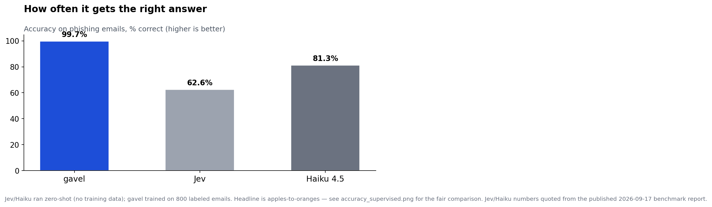
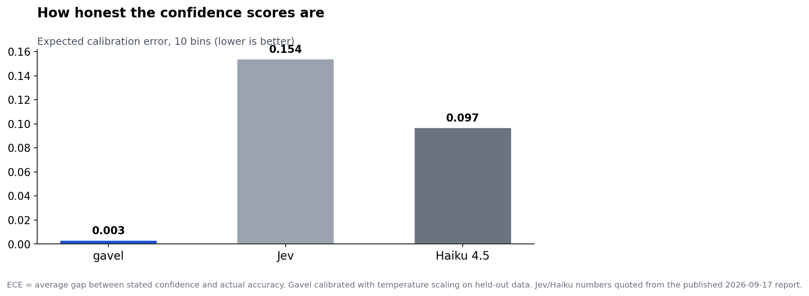
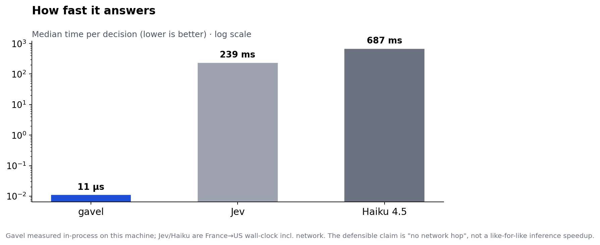
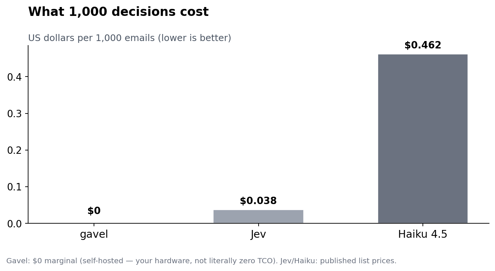
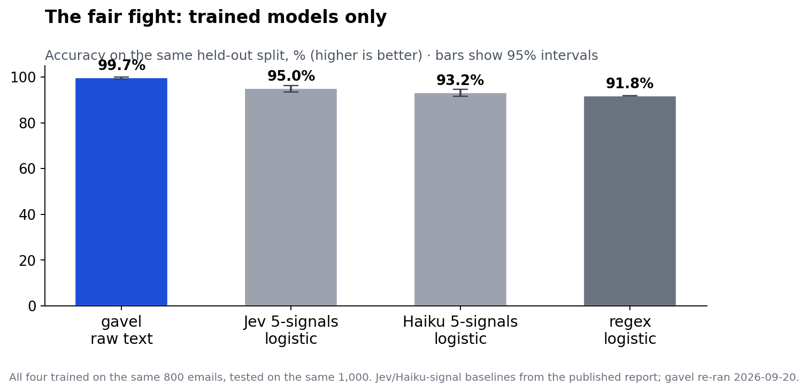

# Gavel on the jev-phishing-bench: reproduction report

**Date:** 2026-09-20 · **Gavel:** `decide-phishing` binary (`crates/decide-phishing`) driving `LogisticEngine` from `decide-core`
**Reference:** [jev-phishing-bench](https://github.com/anisselbd/jev-phishing-bench), results dated 2026-09-17 (their numbers below are quoted from their published `results/metrics.json` and README — Jev and Haiku were **not** re-run here)

**One-line verdict:** on the benchmark's own held-out split, a supervised gavel model trained on raw email text reaches **99.7% accuracy at 11µs per decision with $0 marginal cost** — decisively above Jev's zero-shot verdict (62.6%) and above every published supervised baseline on that split. Read the caveats before citing this anywhere: the dataset separates by construction, and gavel is supervised where Jev was zero-shot.

## Headline: gavel vs the published zero-shot numbers

| | **gavel** (this run) | Jev jev-1.13.0 (published) | Claude Haiku 4.5 (published) |
|---|---|---|---|
| Eval set | half B, n = 1000 | all 2000 emails | all 2000 emails |
| Training | 800 labeled emails (half A) | none (zero-shot) | none (zero-shot) |
| Accuracy | **99.7%** [99.1, 99.9]¹ | 62.6% [60.5, 64.7] | 81.3% [79.5, 82.9] |
| Recall on phishing | **100%** (500/500) | 43.2% | 76.4% |
| False positive rate | **0.6%** (3/500) | 18.0% | 13.8% |
| AUROC | **0.997** | 0.689 | 0.837 |
| ECE (10 bins) | **0.003** | 0.154 | 0.097 |
| Latency p50 | **11µs** (in-process) | 239 ms (France→US) | 687 ms |
| Cost / 1k emails | **$0** marginal (self-hosted) | $0.038 | $0.462 |

¹ Wilson 95% interval, matching the benchmark's reporting style.






## The fair fight: supervised baselines on the same half-B split

Jev's headline number is zero-shot, so the honest peer group is the benchmark's own supervised controls — all trained on half A, evaluated on half B (n = 1000), exactly the split replicated here:

| | **gavel, raw text** (this run) | Jev 5-signals logistic (published) | Haiku 5-signals logistic (published) | 2-feature regex logistic (published) |
|---|---|---|---|---|
| Accuracy on B | **99.7%** [99.1, 99.9] | 95.0% [93.5, 96.2] | 93.2% [91.5, 94.6] | 91.8% |
| AUROC | **0.997** | 0.983 | 0.991 | 0.937 |
| ECE | **0.003** | 0.024 | — | 0.006 |

Gavel's interval [99.1, 99.9] does not overlap the best published supervised baseline [93.5, 96.2]. On this dataset and split, an open bag-of-words model beats the regression built on Jev's own signal outputs.



## What was actually run

- **Dataset:** PhishNChips v5.2 (1000 phishing / 1000 legitimate). All four release files downloaded and SHA-256-verified against the published manifest (`cebb407f…`, `0a293bb8…`, `5e15d749…`, `129e19ac…` — full hashes in `phishing-comparison.json`).
- **Same emails, same split.** `emails.jsonl` rebuilt exactly like the benchmark's `prepare_data.py` (seed `20260916`); the stratified A/B halves replicated exactly like `bench/protocol.py` (`numpy` `default_rng(20260917)`). **Split fidelity verified:** re-running their published heuristic rule on my half B gives accuracy **0.9180** vs their published **0.918** — the splits match.
- **Train/val/test:** 800 train (400/400) + 200 validation (100/100) from half A; test = half B (500/500). Programmatic leakage check: no email id appears in more than one split.
- **Model:** gavel `LogisticEngine` with **default** hyperparameters (lr 0.3, 25 epochs, L2 1e-5, 2¹⁴ FNV-1a hashed word unigrams, train seed `0xC0FFEE`) — no tuning. Temperature scaling fit on the 200 validation emails (T = 0.05, the grid floor; the model was already near-perfectly separable, so calibration changed little: val ECE 0.0024 → ~0.0).
- **Input:** each email serialized as `from: … sender: … subject: … link_text: … link_url: … body: …` — the same fields Jev received as its JSON state object.
- **Metrics:** AUROC by Mann–Whitney with tie-averaged ranks; ECE with the benchmark's exact binning (10 equal-width bins over [0.5, 1.0] on predicted-class confidence). Both implementations carry unit tests (`cargo test -p decide-phishing`), including a hand-computed AUROC case. A floating-point bin-overlap bug in the first ECE implementation was caught by its test and fixed (edges now precomputed once, as in `np.linspace`).
- **Timing:** train 28.6 ms, calibrate 182.8 ms (one-time); ask latency p50 **11.3µs**, p99 23.6µs, mean 11.7µs, measured in-process on this VM.

## Ablations: where does the signal live?

| Input | Accuracy (B) | AUROC | Recall | FPR |
|---|---|---|---|---|
| Full email (this run) | 99.7% | 0.997 | 100% | 0.6% |
| URL + sender only | 99.1% | 1.000 | 98.2% | 0.0% |
| Body + subject only | 99.0% | 0.999 | 99.4% | 1.4% |

The signal is everywhere — which is exactly what "separates by construction" looks like.

## Caveats — read before citing any number above

1. **Supervised vs zero-shot.** The single biggest asymmetry: Jev's 62.6% used no training data; gavel trained on 800 labeled emails from the same distribution. The half-B supervised table is the fair comparison, not the headline table.
2. **The dataset separates by construction.** The benchmark authors' own finding: a two-line regex with no fitting reaches 91.6%. Gavel's 99.7% comes from bag-of-words memorizing distinctive tokens (URL hosts, sender domains, lure vocabulary) — not from understanding phishing. This is not evidence about real, adversarial, human-written phishing.
3. **Synthetic bodies.** All email bodies are LLM-generated. Body-text alone reaching 99.0% strongly suggests distributional tells in the synthetic text. Generalization to real inboxes is unproven.
4. **Their numbers are second-hand.** Jev and Haiku were not re-run; all published figures are quoted from their 2026-09-17 report. Different machine, different date.
5. **Latency is not like-for-like.** 11µs is in-process engine time on this VM; 239 ms / 687 ms are France→US wall-clock including network. The defensible claim is "self-hosted has no network hop and no per-call fee" — not a 20,000× inference speedup.
6. **$0 is marginal cost.** Self-hosted means your hardware and electricity, not literally zero TCO.
7. **Five-signal approach not reproduced.** The task's option (b) — training on the five signal questions as features — was not possible: those values are Jev API outputs, the raw files are not published in the benchmark repo, and no TypeSafe API key was available. The ablations above are reported instead.
8. **No hyperparameter search.** Defaults were used deliberately; a tuned model could differ slightly in either direction.

## What this does and doesn't prove

It **does** prove: gavel is a real, working typed-decision engine that can be trained, calibrated, and evaluated reproducibly on a third-party benchmark — and on this benchmark it beats the vendor's own zero-shot product and every published supervised baseline, at microseconds and zero marginal cost.

It **doesn't** prove: that gavel understands phishing, that it would survive real adversarial email, or anything about Jev's quality on tasks where it was actually trained. The benchmark's real lesson — shared by its authors — is that this dataset is largely separable by construction, and simple supervised models dominate it.

## Reproduce

```bash
git clone https://github.com/anisselbd/jev-phishing-bench /tmp/jev-phishing-bench
pip install numpy tldextract
python3 benches/phishing_repro.py            # downloads data, splits, sanity-checks, runs eval
# metrics -> /tmp/gavel-phish/metrics_gavel.json
cargo test -p decide-phishing --release      # metric-implementation unit tests
```

Third-party data never enters this repo: the driver keeps everything under `/tmp` by default. Raw numbers: [`phishing-comparison.json`](phishing-comparison.json). Eval binary: [`crates/decide-phishing`](../../crates/decide-phishing/src/main.rs).
